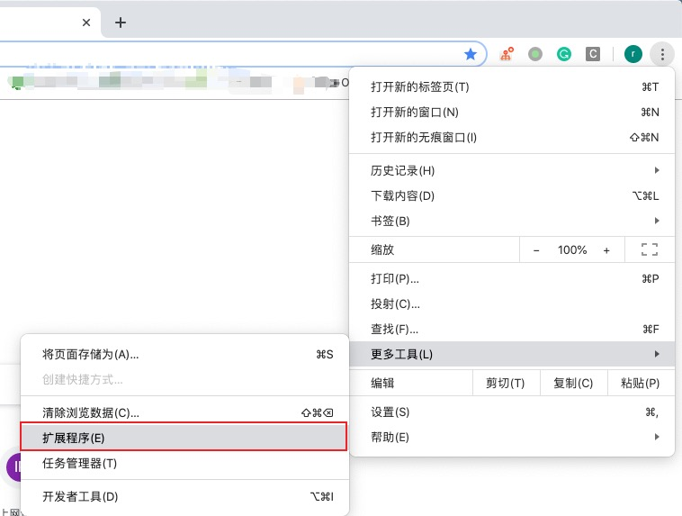
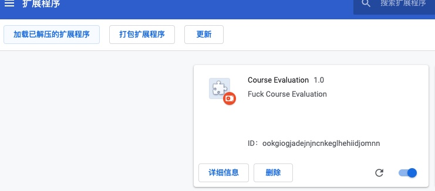
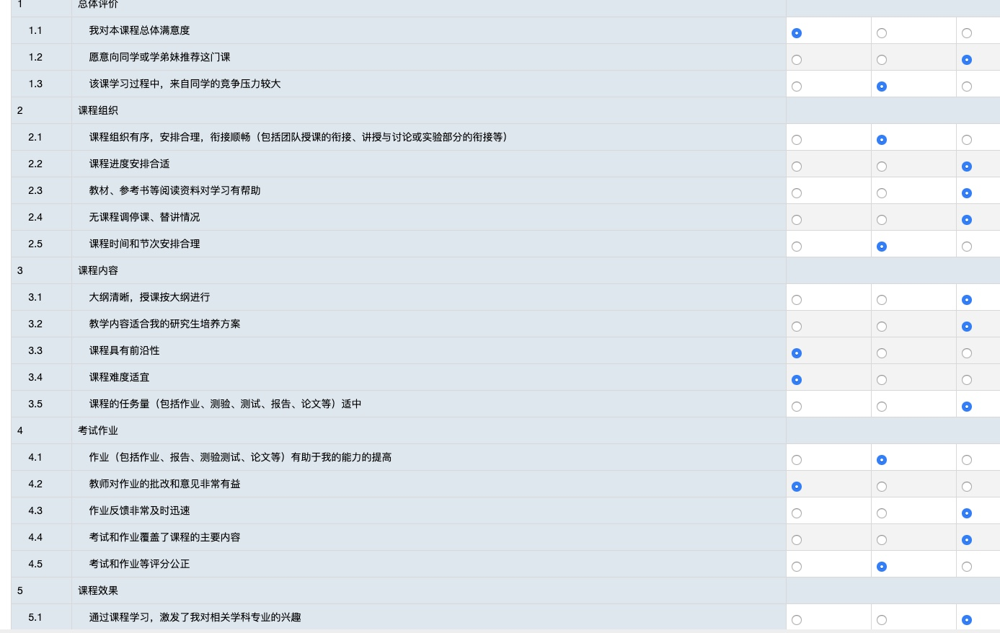

## Course Evaluation Script
这个脚本可以自动填充课程网站评价系统的表单。
### Guide
首先下载这个repo,
```shell
$ git clone https://github.com/Ref-rain/course-evaluation.git
```
#### 打开谷歌浏览器的扩展程序

#### 打开开发者模式

#### 点击"加载已解压的的扩展程序",将下载的文件夹加载进来

#### 加载成功后

#### 打开课程网站的评价，可以看到如下结果
